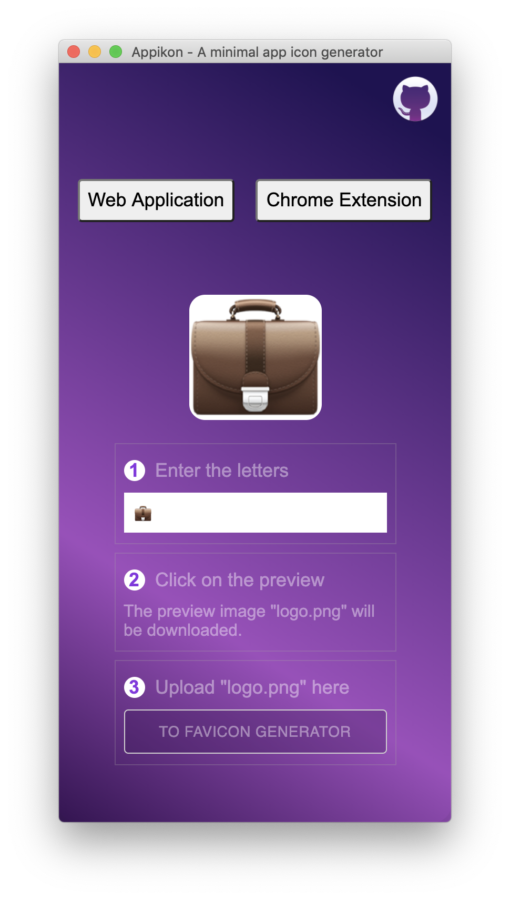
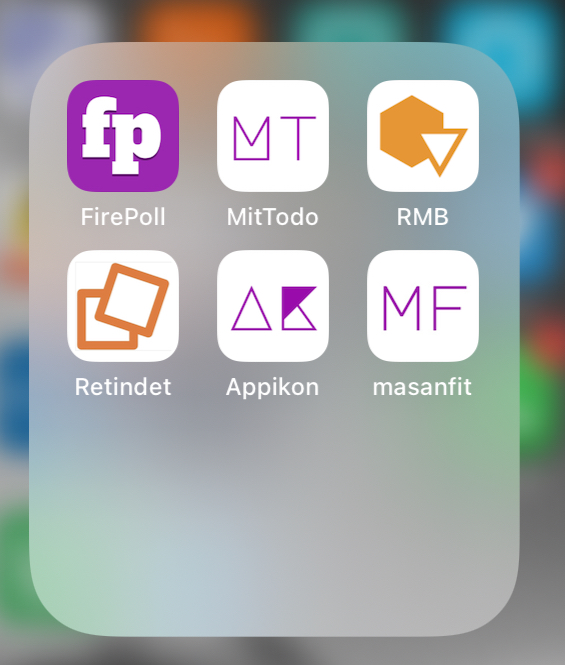

<div align="center">
  <!-- Logo and title and sub-title -->
  <h1 style="font-weight: bolder; color: black; margin-top: 0px">Appikon</h1>
  <h3 style="color: darkgrey; margin: 40px 0"> 
    A simple App Icon Generator
  </h3>

  <!-- description of project -->
  <p>
    Use text or emoji to generate the nice PNG image, which can be used by online service <a href="https://www.favicon-generator.org/">favicon-generator</a>. No time to design app icon or favicon, this can be a nice alternative.
  </p>

  <!-- github icons for PR and License -->
  <p>
    <a href="#">
      
    </a>
    <a href="#">
      
    </a>
  </p>
  
</div>

---
## Demo
Icon generated by `appikon` and final effect on `ios` device.


## Install
```bash
 npm install 
```

## Available Scripts

In the project directory, you can run:

### `npm start`

Runs the app in the development mode.<br>
Open [http://localhost:3000](http://localhost:3000) to view it in the browser.

The page will reload if you make edits.<br>
You will also see any lint errors in the console.

### `npm test`

Launches the test runner in the interactive watch mode.<br>
See the section about [running tests](https://facebook.github.io/create-react-app/docs/running-tests) for more information.

### `npm run build`

Builds the app for production to the `build` folder.<br>
It correctly bundles React in production mode and optimizes the build for the best performance.

The build is minified and the filenames include the hashes.<br>
Your app is ready to be deployed!

See the section about [deployment](https://facebook.github.io/create-react-app/docs/deployment) for more information.
